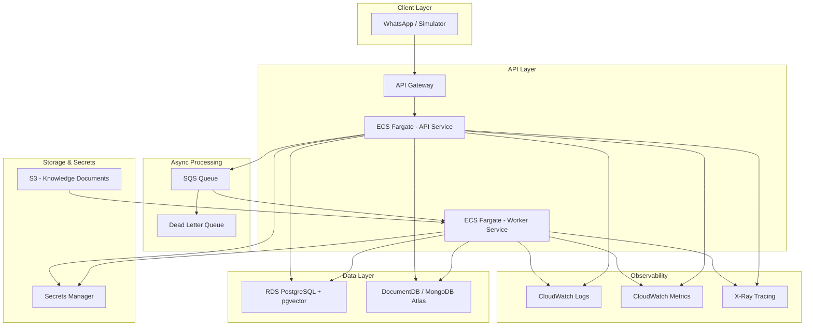

# DESIGN.md

## MessengerHub — System Design

This document defines the data model, API contracts, AI pipeline, and frontend views for the MessengerHub AI clinic assistant.

> **Implementation status (2026-10-03):** All phases 1–9 are implemented (domain, persistence, CQRS, LLM/RAG/orchestration, async processing, API layer, frontend dashboard, seed data, testing, structured logging). Sections describing AWS production deployment are the **target design** for future work. Where implementation details differ from an earlier draft of this document, the code is authoritative.

---

# 1. Data Model

## PostgreSQL — Transactional & Relational Data

PostgreSQL handles the core domain where ACID properties, foreign key constraints, and uniqueness are mandatory: clinics, doctors, availability slots, appointments, and the knowledge base (with pgvector for semantic search).

Schema is defined in `apps/api/prisma/schema.prisma` and managed with Prisma Migrate. The SQL below represents the generated tables for reference.

### clinics

```prisma
model Clinic {
  id          String   @id @default(dbgenerated("gen_random_uuid()")) @db.Uuid
  name        String
  address     String
  phone       String
  timezone    String   @default("America/Bogota")
  createdAt   DateTime @default(now()) @map("created_at") @db.Timestamptz
  updatedAt   DateTime @updatedAt @map("updated_at") @db.Timestamptz

  doctors     Doctor[]
  slots       Slot[]
  appointments Appointment[]

  @@map("clinics")
}
```

Generated SQL:

```sql
CREATE TABLE clinics (
  id          UUID PRIMARY KEY DEFAULT gen_random_uuid(),
  name        TEXT NOT NULL,
  address     TEXT NOT NULL,
  phone       TEXT NOT NULL,
  timezone    TEXT NOT NULL DEFAULT 'America/Bogota',
  created_at  TIMESTAMPTZ NOT NULL DEFAULT now(),
  updated_at  TIMESTAMPTZ NOT NULL DEFAULT now()
);
```

### doctors

```prisma
model Doctor {
  id           String   @id @default(dbgenerated("gen_random_uuid()")) @db.Uuid
  clinicId     String   @map("clinic_id") @db.Uuid
  name         String
  specialty    String
  active       Boolean  @default(true)
  createdAt    DateTime @default(now()) @map("created_at") @db.Timestamptz
  updatedAt    DateTime @updatedAt @map("updated_at") @db.Timestamptz

  clinic       Clinic   @relation(fields: [clinicId], references: [id])
  slots        Slot[]
  appointments Appointment[]

  @@index([clinicId])
  @@index([specialty])
  @@index([clinicId, specialty])
  @@map("doctors")
}
```

Generated SQL:

```sql
CREATE TABLE doctors (
  id          UUID PRIMARY KEY DEFAULT gen_random_uuid(),
  clinic_id   UUID NOT NULL REFERENCES clinics(id),
  name        TEXT NOT NULL,
  specialty   TEXT NOT NULL,
  active      BOOLEAN NOT NULL DEFAULT true,
  created_at  TIMESTAMPTZ NOT NULL DEFAULT now(),
  updated_at  TIMESTAMPTZ NOT NULL DEFAULT now()
);
```

#### Indexes

```sql
CREATE INDEX idx_doctors_clinic_id ON doctors(clinic_id);
CREATE INDEX idx_doctors_specialty ON doctors(specialty);
CREATE INDEX idx_doctors_clinic_specialty ON doctors(clinic_id, specialty);
```

### slots

```prisma
model Slot {
  id          String   @id @default(dbgenerated("gen_random_uuid()")) @db.Uuid
  clinicId    String   @map("clinic_id") @db.Uuid
  doctorId    String   @map("doctor_id") @db.Uuid
  startTime   DateTime @map("start_time") @db.Timestamptz
  endTime     DateTime @map("end_time") @db.Timestamptz
  isBooked    Boolean  @default(false) @map("is_booked")
  createdAt   DateTime @default(now()) @map("created_at") @db.Timestamptz

  clinic      Clinic   @relation(fields: [clinicId], references: [id])
  doctor      Doctor   @relation(fields: [doctorId], references: [id])
  appointment Appointment?

  @@unique([doctorId, startTime])
  @@index([clinicId, startTime])
  @@index([isBooked])
  @@index([clinicId, isBooked, startTime])
  @@map("slots")
}
```

Generated SQL:

```sql
CREATE TABLE slots (
  id          UUID PRIMARY KEY DEFAULT gen_random_uuid(),
  clinic_id   UUID NOT NULL REFERENCES clinics(id),
  doctor_id   UUID NOT NULL REFERENCES doctors(id),
  start_time  TIMESTAMPTZ NOT NULL,
  end_time    TIMESTAMPTZ NOT NULL,
  is_booked   BOOLEAN NOT NULL DEFAULT false,
  created_at  TIMESTAMPTZ NOT NULL DEFAULT now(),

  UNIQUE (doctor_id, start_time)
);
```

#### Indexes

```sql
CREATE INDEX idx_slots_clinic_start ON slots(clinic_id, start_time);
CREATE INDEX idx_slots_is_booked ON slots(is_booked);
CREATE INDEX idx_slots_available ON slots(clinic_id, is_booked, start_time);
```

#### Constraints

- `end_time` must be > `start_time` (enforced at application layer).
- `UNIQUE(doctor_id, start_time)` prevents duplicate slots for the same doctor at the same time.
- `is_booked` is the primary filter for availability queries.

### appointments

```prisma
model Appointment {
  id          String            @id @default(dbgenerated("gen_random_uuid()")) @db.Uuid
  clinicId    String            @map("clinic_id") @db.Uuid
  doctorId    String            @map("doctor_id") @db.Uuid
  slotId      String            @unique @map("slot_id") @db.Uuid
  patientPhone String           @map("patient_phone")
  patientName String?           @map("patient_name")
  status      AppointmentStatus @default(CONFIRMED)
  createdAt   DateTime          @default(now()) @map("created_at") @db.Timestamptz
  updatedAt   DateTime          @updatedAt @map("updated_at") @db.Timestamptz

  clinic      Clinic            @relation(fields: [clinicId], references: [id])
  doctor      Doctor            @relation(fields: [doctorId], references: [id])
  slot        Slot              @relation(fields: [slotId], references: [id])

  @@index([patientPhone])
  @@index([clinicId, status])
  @@index([doctorId, createdAt])
  @@map("appointments")
}
```

Generated SQL:

```sql
CREATE TABLE appointments (
  id            UUID PRIMARY KEY DEFAULT gen_random_uuid(),
  clinic_id     UUID NOT NULL REFERENCES clinics(id),
  doctor_id     UUID NOT NULL REFERENCES doctors(id),
  slot_id       UUID NOT NULL UNIQUE REFERENCES slots(id),
  patient_phone TEXT NOT NULL,
  patient_name  TEXT,
  status        TEXT NOT NULL DEFAULT 'CONFIRMED' CHECK (status IN ('CONFIRMED', 'CANCELLED')),
  created_at    TIMESTAMPTZ NOT NULL DEFAULT now(),
  updated_at    TIMESTAMPTZ NOT NULL DEFAULT now()
);
```

#### Indexes

```sql
CREATE INDEX idx_appointments_patient_phone ON appointments(patient_phone);
CREATE INDEX idx_appointments_clinic_status ON appointments(clinic_id, status);
CREATE INDEX idx_appointments_doctor_created ON appointments(doctor_id, created_at);
```

#### Constraints

- `slot_id` is `UNIQUE` — this is the mechanism that prevents double-booking. A slot can only have one appointment.
- The `is_booked` flag on `slots` is updated transactionally when an appointment is created or cancelled.

### knowledge_documents

```prisma
model KnowledgeDocument {
  id          String   @id @default(dbgenerated("gen_random_uuid()")) @db.Uuid
  clinicId    String   @map("clinic_id") @db.Uuid
  title       String
  content     String
  category    String
  embedding   Unsupported("vector(768)")? // set via raw SQL (seed T-7.1 / KnowledgeRepository.create)
  createdAt   DateTime @default(now()) @map("created_at") @db.Timestamptz
  updatedAt   DateTime @updatedAt @map("updated_at") @db.Timestamptz

  clinic      Clinic   @relation(fields: [clinicId], references: [id])

  @@index([clinicId])
  @@index([category])
  @@map("knowledge_documents")
}
```

Generated SQL (from `apps/api/prisma/migrations/*/migration.sql`):

```sql
CREATE EXTENSION IF NOT EXISTS vector;

CREATE TABLE knowledge_documents (
  id          UUID PRIMARY KEY DEFAULT gen_random_uuid(),
  clinic_id   UUID NOT NULL REFERENCES clinics(id),
  title       TEXT NOT NULL,
  content     TEXT NOT NULL,
  category    TEXT NOT NULL,
  embedding   vector(768),
  created_at  TIMESTAMPTZ NOT NULL DEFAULT now(),
  updated_at  TIMESTAMPTZ NOT NULL DEFAULT now()
);

CREATE INDEX idx_knowledge_docs_clinic_id ON knowledge_documents(clinic_id);
CREATE INDEX idx_knowledge_docs_category ON knowledge_documents(category);
CREATE INDEX "idx_knowledge_docs_embedding" ON "knowledge_documents" USING ivfflat (embedding vector_cosine_ops) WITH (lists = 100);
```

#### Notes (implementation)

- `embedding` uses pgvector with 768 dimensions (Google `gemini-embedding-001`, requested with explicit `dimensions: 768`). The column remains nullable in Prisma (`Unsupported("vector(768)")`); embeddings are persisted via raw SQL after insert. Full seed data is provided by `T-7.1`.
- The IVFFlat cosine index (`lists = 100`) is created in the **migration SQL**, not declared in `schema.prisma`. If you regenerate migrations from the schema, re-apply this index manually (or use a raw SQL migration) to avoid drift.
- Semantic search uses cosine distance: `ORDER BY embedding <=> $1 LIMIT 5`, with results filtered by `1 - (embedding <=> $vec) > 0.7` (`RAG_SIMILARITY_THRESHOLD`).
- The IVFFlat index is suitable for up to ~1M rows. For larger datasets, switch to HNSW.

---

## MongoDB — Conversations, Messages & AI Traces

MongoDB handles high-volume, flexible-schema data that grows rapidly and does not require relational constraints: chat histories and AI execution traces.

### conversations

```typescript
interface ConversationDocument {
  _id: string;                    // UUID
  clinicId: string;               // References PostgreSQL clinic
  patientPhone: string;           // E.164 format
  status: 'active' | 'resolved_by_ai' | 'appointment_booked' | 'escalated';
  createdAt: Date;
  updatedAt: Date;
  lastMessageAt: Date;
}
```

#### Indexes

```javascript
// apps/api/src/infrastructure/database/mongo-indexes.ts
db.conversations.createIndex({ clinicId: 1, status: 1 });
db.conversations.createIndex({ clinicId: 1, patientPhone: 1 });
db.conversations.createIndex({ lastMessageAt: -1 });
```

### messages

```typescript
interface MessageDocument {
  _id: string;                    // UUID
  conversationId: string;         // References ConversationDocument
  clinicId: string;               // Denormalized for tenant queries
  direction: 'inbound' | 'outbound';
  role: 'user' | 'assistant' | 'system';
  content: string;
  messageId?: string;             // WhatsApp message_id (idempotency)
  createdAt: Date;
}
```

#### Indexes

```javascript
db.messages.createIndex({ messageId: 1 }, { unique: true, sparse: true });
db.messages.createIndex({ conversationId: 1, createdAt: 1 });
db.messages.createIndex({ clinicId: 1, createdAt: -1 });
```

### ai_traces

```typescript
interface AITraceDocument {
  _id: string;                    // UUID
  conversationId: string;
  clinicId: string;
  turnIndex: number;              // Position within conversation
  model: string;                  // e.g., "gemini-2.5-flash"
  inputTokens: number;
  outputTokens: number;
  latencyMs: number;
  costUsd: number;
  toolsCalled: {
    name: string;
    arguments: Record<string, unknown>;
    result: unknown;
    success: boolean;
  }[];
  finalStatus: 'resuelta_por_ia' | 'cita_agendada' | 'escalada';
  createdAt: Date;
}
```

#### Indexes

```javascript
db.ai_traces.createIndex({ conversationId: 1, turnIndex: 1 });
db.ai_traces.createIndex({ clinicId: 1, createdAt: -1 });
db.ai_traces.createIndex({ finalStatus: 1 });
```

---

## Dual-Database Consistency

| Operation | PostgreSQL (Transactional) | MongoDB (Eventual) | Consistency Strategy |
|-----------|---------------------------|--------------------|--------------------|
| New message received | — | Insert message | MongoDB is the source of truth for chat history |
| Appointment booked | INSERT appointment, UPDATE slot.is_booked = true | Update conversation status *(pending Phase 4/5 wiring)* | PostgreSQL transaction commits first; MongoDB update follows. If MongoDB update fails, a background reconciliation job retries. |
| Conversation escalated | — | Update conversation status + insert AI trace | Both writes to MongoDB; no cross-DB transaction needed. |
| Knowledge query (RAG) | SELECT with pgvector cosine search | — | Single DB read, no consistency issue. |

**Rule:** When an operation touches both databases, PostgreSQL commits first (it holds the source of truth for appointments). MongoDB updates are retried on failure. The system accepts eventual consistency for conversation state.

**Implementation note (current):** `AIOrchestratorService.processTurn` returns the resulting `ConversationStatus` and persists an `AITrace`. Conversation status is persisted by `MessageProcessorService` (worker, T-4.2) via `ConversationRepository.updateStatus` after each turn. The `ConversationEscalatedEvent` domain event is defined but not yet published at runtime.

---

# 2. Domain Entities

## Clinic

```typescript
interface Clinic {
  readonly id: string;
  readonly name: string;
  readonly address: string;
  readonly phone: string;
  readonly timezone: string;
  readonly createdAt: Date;
  readonly updatedAt: Date;
}
```

## Doctor

```typescript
interface Doctor {
  readonly id: string;
  readonly clinicId: string;
  readonly name: string;
  readonly specialty: string;
  readonly active: boolean;
  readonly createdAt: Date;
  readonly updatedAt: Date;
}
```

## Slot

```typescript
interface Slot {
  readonly id: string;
  readonly clinicId: string;
  readonly doctorId: string;
  readonly startTime: Date;
  readonly endTime: Date;
  readonly isBooked: boolean;
  readonly createdAt: Date;
}
```

## Appointment

```typescript
interface Appointment {
  readonly id: string;
  readonly clinicId: string;
  readonly doctorId: string;
  readonly slotId: string;
  readonly patientPhone: string;
  readonly patientName: string | null;
  readonly status: AppointmentStatus;
  readonly createdAt: Date;
  readonly updatedAt: Date;
}
```

## AppointmentStatus

```typescript
enum AppointmentStatus {
  CONFIRMED = 'CONFIRMED',
  CANCELLED = 'CANCELLED',
}
```

## ConversationStatus

```typescript
enum ConversationStatus {
  ACTIVE = 'active',
  RESOLVED_BY_AI = 'resolved_by_ai',
  APPOINTMENT_BOOKED = 'appointment_booked',
  ESCALATED = 'escalated',
}
```

---

# 3. Status Lifecycles

## Conversation Status

```text
active ──────► resolved_by_ai
   │
   ├───► appointment_booked
   │
   └───► escalated
```

| From | To | Trigger |
|------|-----|---------|
| `active` | `resolved_by_ai` | LLM answers from knowledge base |
| `active` | `appointment_booked` | Appointment successfully created |
| `active` | `escalated` | LLM calls `escalar_a_humano` tool |

A conversation can have multiple `active` turns before transitioning to a terminal state. Once terminal, it does not revert.

## Appointment Status

```text
CONFIRMED ──────► CANCELLED
```

| From | To | Effect |
|------|-----|--------|
| `CONFIRMED` | `CANCELLED` | `slot.is_booked` is set back to `false` |

Invalid transitions (must reject):
- `CANCELLED` → `CONFIRMED` (book a new appointment instead).

---

# 4. AI Pipeline Design

## Tool Calling Flow

```text
Patient Message
      │
      ▼
┌─────────────────────┐
│  Load Conversation   │  ← MongoDB: fetch message history
│  History             │
└─────────┬───────────┘
          │
          ▼
┌─────────────────────┐
│  Build Prompt        │  ← System prompt + history + current message
│  (System + Context)  │
└─────────┬───────────┘
          │
          ▼
┌─────────────────────┐
│  Call LLM            │  ← With tool definitions
│  (tool_choice: auto) │
└─────────┬───────────┘
          │
          ├─── No tool call → Return response to patient
          │
          ▼
┌─────────────────────┐
│  Validate Arguments  │  ← Zod schema validation + domain rules
│  (Untrusted Input)   │
└─────────┬───────────┘
          │
          ├─── Invalid → Return error to LLM for correction
          │
          ▼
┌─────────────────────┐
│  Execute Tool        │  ← Domain service call
└─────────┬───────────┘
          │
          ├─── Error → Return error to LLM for retry or escalation
          │
          ▼
┌─────────────────────┐
│  Return Result       │  ← Feed tool result back to LLM
│  to LLM              │
└─────────┬───────────┘
          │
          ▼
┌─────────────────────┐
│  Check Iteration     │  ← Max 5 iterations
│  Limit               │
└─────────┬───────────┘
          │
          ├─── Limit reached → Force escalation
          │
          └─── Continue loop if more tool calls needed
```

## Tool Definitions

### buscar_conocimiento(pregunta: string)

- **Purpose:** Semantic search (RAG) over clinic knowledge base.
- **Implementation:** Embed the query with the same model used for documents, then run cosine similarity search via pgvector.
- **Validation:** `pregunta` must be a non-empty string.
- **Returns:** Top 5 matching document chunks with title, content, and similarity score.
- **Hallucination control:** If no document has similarity > 0.7, return "No relevant information found" — the LLM must respond that it does not have that information.

### consultar_disponibilidad(especialidad: string, sede: string, fecha: string)

- **Purpose:** Query real available slots from PostgreSQL.
- **Validation:**
  - `especialidad` must match an existing specialty in the clinic.
  - `sede` (clinic name) must match an existing clinic.
  - `fecha` must be a valid date in `YYYY-MM-DD` format, not in the past (interpreted in Colombia time UTC-5).
- **Returns:** List of available slots with doctor name, start time, and end time.
- **Error cases:** No slots available → return empty list (LLM informs patient).

### agendar_cita(sede: string, especialidad: string, fecha: string, hora: string, paciente_telefono: string, paciente_nombre?: string)

- **Purpose:** Create an appointment in PostgreSQL.
- **Validation (all before execution):**
  - All `consultar_disponibilidad` validations apply.
  - The specific slot must exist and `is_booked = false`.
  - `paciente_telefono` must be a valid phone format.
  - `fecha` + `hora` must correspond to an actual available slot.
- **Execution:** Transactional — `INSERT` appointment + `UPDATE slot SET is_booked = true` in a single transaction.
- **Idempotency:** If the slot is already booked (race condition), return a clear error. The LLM suggests alternative times.
- **Returns:** Confirmation with appointment details.

### escalar_a_humano(motivo: string)

- **Purpose:** Mark conversation for human attention.
- **Validation:** `motivo` must be a non-empty string.
- **Effect (target):** Updates conversation status to `escalated` in MongoDB.
- **Effect (current):** The orchestrator returns `ConversationStatus.ESCALATED` with a fixed acknowledgment message and records the trace. Persisting status in MongoDB happens in the worker (`MessageProcessorService`) after `processTurn`.

## Prompt Construction

```text
System Prompt:
  "You are a scheduling assistant for [Clinic Name]. You help patients with
   questions about the clinic and booking appointments. You must ONLY use
   information from the knowledge base. If you don't know the answer, say so
   honestly or escalate to a human. Current date and time in Colombia: [datetime].
   Available tools: buscar_conocimiento, consultar_disponibilidad, agendar_cita,
   escalar_a_humano."

Conversation History:
  [Previous messages in the conversation]

Current Message:
  [Patient's latest message]
```

## Iteration Limits

- Maximum **5 tool-call iterations** per turn.
- If the limit is reached without resolution, the system forces `escalar_a_humano` with an auto-generated reason.
- Each iteration is traced in `ai_traces` for debugging.

---

# 5. API Contracts

> **Implementation status (2026-10-03):** `POST /webhooks/messages`, `GET /api/conversations`, `GET /api/conversations/:id`, `POST /api/simulator`, and `GET /api/clinics` are implemented (`presentation/controllers/`). Global exception filter and class-validator `ValidationPipe` remain T-5.2. Note: list responses omit `messageCount` (not computed by `ListConversationsHandler` yet).

## Base URL

```text
http://localhost:3000
```

## Endpoints

### POST /webhooks/messages

Receives incoming messages (simulates WhatsApp). Responds fast; LLM processing happens asynchronously.

**Request:**

```json
{
  "message_id": "wamid.001",
  "from": "+573001112233",
  "text": "Hola, ¿tienen cita con dermatología mañana en la tarde?",
  "timestamp": "2026-10-06T03:40:00Z"
}
```

**Response (202 Accepted):**

```json
{
  "status": "accepted",
  "conversationId": "uuid"
}
```

**Behavior:**

- Returns `202 Accepted` immediately.
- Pushes message to processing queue (BullMQ in development; SQS in production).
- Clinic scoping: optional `clinic_id` in the body, or `DEFAULT_CLINIC_ID` env.
- Invalid bodies return `400` with `{ "error": "ValidationError", "message": "..." }`.
- If `message_id` already exists, returns `200 OK` with `{ "status": "duplicate", "conversationId": "uuid" }` — no reprocessing.
- Worker picks up the message, loads conversation history, calls LLM, and sends response.

### GET /api/clinics

Lists clinic options for dashboard dropdowns (Simulator, conversation filters).

**Response (200):**

```json
[
  { "id": "uuid", "name": "Clínica Norte" },
  { "id": "uuid", "name": "Clínica Sur" }
]
```

**Behavior:**

- Returns all clinics ordered by `name` ascending.
- Response items include only `id` and `name` (sufficient for select controls).
- Empty array when no clinics exist.

### GET /api/conversations

Lists conversations for the dashboard.

**Query Parameters:**

| Param | Type | Required | Description |
|-------|------|----------|-------------|
| `status` | string | No | Filter by status (`active`, `resolved_by_ai`, `appointment_booked`, `escalated`) |
| `clinicId` | UUID | No | Filter by clinic |
| `page` | number | No | Page number (default: 1) |
| `limit` | number | No | Items per page (default: 20, max: 100) |

**Response (200):**

```json
{
  "data": [
    {
      "id": "uuid",
      "clinicId": "uuid",
      "clinicName": "Clínica Norte",
      "patientPhone": "+573001112233",
      "status": "resolved_by_ai",
      "messageCount": 6,
      "lastMessageAt": "2026-10-06T03:45:00Z",
      "createdAt": "2026-10-06T03:40:00Z"
    }
  ],
  "pagination": {
    "page": 1,
    "limit": 20,
    "total": 150,
    "totalPages": 8
  }
}
```

### GET /api/conversations/:id

Gets conversation details with messages and AI traces.

**Response (200):**

```json
{
  "id": "uuid",
  "clinicId": "uuid",
  "clinicName": "Clínica Norte",
  "patientPhone": "+573001112233",
  "status": "appointment_booked",
  "createdAt": "2026-10-06T03:40:00Z",
  "messages": [
    {
      "id": "uuid",
      "direction": "inbound",
      "role": "user",
      "content": "Hola, ¿tienen cita con dermatología mañana en la tarde?",
      "createdAt": "2026-10-06T03:40:00Z"
    },
    {
      "id": "uuid",
      "direction": "outbound",
      "role": "assistant",
      "content": "Sí, tengo disponibilidad con dermatología mañana. ¿Te gustaría agendar con el Dr. García a las 3:00 PM o con la Dra. López a las 4:30 PM?",
      "createdAt": "2026-10-06T03:40:05Z"
    }
  ],
  "aiTraces": [
    {
      "id": "uuid",
      "turnIndex": 1,
      "model": "gemini-2.5-flash",
      "inputTokens": 1250,
      "outputTokens": 180,
      "latencyMs": 2300,
      "costUsd": 0.0004,
      "toolsCalled": [
        {
          "name": "consultar_disponibilidad",
          "arguments": {
            "especialidad": "dermatología",
            "sede": "Clínica Norte",
            "fecha": "2026-10-07"
          },
          "result": [
            {
              "doctorName": "Dr. García",
              "startTime": "2026-10-07T15:00:00-05:00",
              "endTime": "2026-10-07T15:30:00-05:00"
            }
          ],
          "success": true
        }
      ],
      "finalStatus": "appointment_booked",
      "createdAt": "2026-10-06T03:40:05Z"
    }
  ]
}
```

### POST /api/simulator

Sends a message as if it came from a patient (for testing).

**Request:**

```json
{
  "from": "+573009998877",
  "text": "¿Qué horarios tienen para exámenes de sangre?",
  "clinicId": "uuid"
}
```

**Response (202):**

```json
{
  "status": "accepted",
  "messageId": "wamid.sim.001",
  "conversationId": "uuid"
}
```

---

# 6. Frontend Views

## View 1: Conversation Inbox

Route: `/conversations`

Components:

- `ConversationFiltersComponent` — filter by status dropdown, clinic select
- `ConversationListComponent` — paginated table with columns: Patient Phone, Clinic, Status, Messages, Last Activity

Behavior:

- Loads conversations on mount with default filters (all statuses, most recent first)
- Refetches on filter change
- Shows loading skeleton during fetch
- Shows empty state when no results
- Shows error message on fetch failure
- Status badges with color coding: `active` (blue), `resolved_by_ai` (green), `appointment_booked` (purple), `escalated` (red)
- Pagination controls at bottom

## View 1b: Patient Simulator (Chat)

Route: `/simulator`

Components:

- `SimulatorComponent` — form mode (phone, clinic select, first message) then chat mode
- `MessageTimelineComponent` — reused WhatsApp-style message bubbles
- Clinic select options from `GET /api/clinics` (Default clinic option omits `clinicId`)

Behavior:

- **Form mode:** phone + clinic dropdown + first message; send via `POST /api/simulator`
- **Chat mode:** after first accepted send, phone and clinic are locked; timeline shows the conversation
- Polls `GET /api/conversations/:id` every 2s until assistant message `assistant:${inboundMessageId}` appears (max ~60s)
- Shows “Assistant is processing…” while waiting; timeout shows an informational message
- Composer sends follow-ups in the same conversation (same phone + clinic)
- Send disabled while a reply is pending
- “New chat” resets to form mode; “View Conversation” opens `/conversations/:id`

## View 2: Conversation Detail

Route: `/conversations/:id`

Components:

- `ConversationHeaderComponent` — patient phone, clinic, status badge, created date
- `MessageTimelineComponent` — chronological list of messages (user vs assistant, styled differently)
- `AITracePanelComponent` — for each assistant message: model, tokens, latency, cost, tools called with arguments and results

Behavior:

- Loads conversation detail on mount (messages + traces)
- Shows loading state during fetch
- Shows error message on failure
- AI traces expand/collapse per turn
- Tool calls show arguments and results in a formatted JSON view

## Shared

- `LayoutComponent` — sidebar nav with links to Conversations and Simulator
- `LoadingSpinnerComponent` — reusable loading indicator
- `ErrorMessageComponent` — reusable error display
- `PaginationComponent` — reusable pagination
- `StatusBadgeComponent` — colored badge for conversation status

---

# 7. Error Catalog

> **Status (2026-10-02):** Error classes live in `apps/api/src/domain/errors/`. HTTP mapping is implemented via `presentation/filters/domain-exception.filter.ts` (global `APP_FILTER` in `PresentationModule`). Request validation stays Zod-based in controllers (no class-validator pipe). Not every catalog entry has a domain error class yet (`DoctorNotFoundError`, `InvalidTimezoneError`, `KnowledgeBaseEmptyError` remain planned).

| Error | HTTP Code | When | Domain class status |
|-------|-----------|------|---------------------|
| `SlotAlreadyBookedError` | 409 | Slot was booked between availability check and booking attempt | Implemented |
| `SlotNotFoundError` | 404 | Requested slot does not exist | Implemented |
| `ClinicNotFoundError` | 404 | Clinic ID or name does not match any clinic | Implemented |
| `DoctorNotFoundError` | 404 | Doctor ID does not match any doctor | Not yet implemented (planned) |
| `InvalidTimezoneError` | 400 | Date/time cannot be interpreted in Colombia timezone | Not yet implemented (planned; current code uses fixed UTC-5 helpers) |
| `PastDateError` | 400 | Attempted to book a slot in the past | Implemented |
| `DuplicateMessageError` | 200 | message_id already processed (not an error, returns existing conversation) | Handled as `duplicate: true` in command result, not a thrown error |
| `LLMProviderError` | 502 | LLM API timeout or failure | Implemented |
| `LLMIterationLimitError` | 500 | Tool calling exceeded max iterations (auto-escalates) | Class implemented/tested; orchestrator currently force-escalates without throwing this error |
| `ValidationError` | 400 | Missing or invalid request fields | Implemented |
| `KnowledgeBaseEmptyError` | 500 | No documents found for the clinic (configuration issue) | Not yet implemented (planned) |

Infrastructure errors (database connection, queue failures) are caught and mapped to 500 responses. The raw error is logged but never exposed to the client.

---

# 8. AWS Architecture

## Architecture Diagram (Mermaid)



## Services

| Concern | Service | Why |
|---------|---------|-----|
| **Compute (API)** | ECS Fargate | Stateless HTTP service; auto-scales with ALB. No EC2 management. |
| **Compute (Worker)** | ECS Fargate (same cluster) | Consumes SQS messages; scales independently based on queue depth. |
| **API Gateway** | API Gateway (HTTP API) | Rate limiting, request validation, JWT auth (future). Cheaper than REST API. |
| **Queue** | SQS + Dead Letter Queue | Decouples webhook from LLM processing. DLQ captures failed messages for inspection. |
| **Relational DB** | RDS PostgreSQL 16 with pgvector | Managed, automated backups, Multi-AZ for HA. pgvector extension available on RDS. |
| **Document DB** | MongoDB Atlas (or DocumentDB) | Atlas preferred for full MongoDB compatibility. DocumentDB if AWS-native is required. |
| **Object Storage** | S3 | Store raw knowledge documents (PDFs, MDs). Lifecycle policy to Glacier after 90 days. |
| **Secrets** | Secrets Manager | LLM API keys, DB credentials. Rotated automatically. |
| **Logs** | CloudWatch Logs | Centralized logging from ECS tasks. Retention: 30 days. |
| **Metrics** | CloudWatch Metrics | Queue depth, API latency, error rates, LLM cost dashboards. |
| **Tracing** | X-Ray | End-to-end request tracing across API → Queue → Worker → LLM. |

## Alternatives Discarded

| Option | Why Discarded |
|--------|---------------|
| Lambda for API | Cold starts add latency; WebSocket connections not supported; 15-min timeout insufficient for future features. ECS Fargate is better for long-running services. |
| Lambda for Worker | LLM calls can take 10–30 seconds. Lambda works but ECS gives more control over concurrency and scaling. |
| Aurora PostgreSQL | Overkill for this scale (50 clinics). RDS is simpler and cheaper. |
| Self-hosted MongoDB | Operational burden. Atlas or DocumentDB handles patching, backups, and scaling. |
| Kinesis | SQS is simpler for point-to-point message processing. Kinesis is for real-time streaming analytics. |

## Scaling Strategy

**For 50 clinics, 20,000 messages/day (~0.23 msgs/sec avg, ~2 msgs/sec peak):**

- **API Service:** 2–4 Fargate tasks behind ALB. Scales on CPU > 60% or request count.
- **Worker Service:** 2–6 Fargate tasks. Scales on SQS `ApproximateNumberOfMessagesVisible`.
- **RDS PostgreSQL:** `db.t3.medium` (2 vCPU, 4 GB RAM). Multi-AZ for failover. Read replica if needed.
- **MongoDB Atlas:** M10 cluster (shared). Scales to M20 if document volume grows.
- **SQS:** Near-infinite scale. No capacity planning needed.

**Failure scenarios:**

| Component | Failure | Recovery |
|-----------|---------|----------|
| ECS task | Crash/OOM | ECS auto-restarts task. ALB health check routes traffic away. |
| RDS | AZ outage | Multi-AZ automatic failover (< 60s). |
| MongoDB | Connection drop | Retry with exponential backoff. Connection pool handles reconnection. |
| SQS | Worker down | Messages accumulate in queue. DLQ after 3 retries. |
| LLM Provider | Timeout/error | Fallback to escalation. Retry once with exponential backoff. |

## Multi-Tenancy Strategy

Each clinic is a tenant. Data isolation:

- **PostgreSQL:** All tables have `clinic_id` as a foreign key. Row-Level Security (RLS) policies ensure queries only return data for the authenticated clinic. No separate schemas or databases.
- **MongoDB:** All documents have `clinicId` field. Queries always filter by `clinicId`. Compound indexes include `clinicId` as the leading field.
- **API Authentication:** JWT tokens include `clinicId` claim. Middleware injects the clinic context into every request.

This approach (shared database, tenant-scoped queries) is cost-effective for 50 clinics. For 500+ clinics, consider schema-per-tenant or database-per-tenant.

## Estimated Monthly Cost

| Service | Configuration | Estimated Cost |
|---------|---------------|----------------|
| ECS Fargate (2 tasks) | 0.5 vCPU, 1 GB RAM each | ~$30/month |
| RDS PostgreSQL | db.t3.medium, Multi-AZ, 50 GB | ~$70/month |
| MongoDB Atlas | M10 shared | ~$57/month |
| SQS | 20k messages/day | ~$1/month |
| API Gateway | 20k requests/day | ~$1/month |
| S3 | 1 GB knowledge docs | ~$0.02/month |
| Secrets Manager | 2 secrets | ~$1/month |
| CloudWatch | Logs + metrics | ~$10/month |
| **Total** | | **~$170/month** |

LLM costs are separate and depend on the provider. At ~$0.0003 per conversation turn (Gemini `gemini-2.5-flash`), 20k messages/day ≈ $6/day ≈ $180/month.

---

# 9. Key Design Decisions

| Decision | Rationale |
|----------|-----------|
| PostgreSQL for transactional data | ACID guarantees for appointments, unique constraints for slot booking, pgvector for RAG |
| MongoDB for conversations/traces | Flexible schema, fast writes, natural fit for document-like chat history |
| pgvector over dedicated vector DB | Single database for knowledge + slots; no extra infrastructure; sufficient for 50 clinics |
| Async processing via queue | LLM latency (5–30s) must not block webhook response |
| Idempotency at DB level | `message_id` unique index prevents duplicate processing |
| UTC storage, Colombia timezone interpretation | "Mañana" at 10:40 PM in Cali means tomorrow, not the day after |
| Zod validation for LLM outputs | LLM arguments are untrusted input; must be validated before execution |
| Max 5 tool-call iterations | Prevents infinite loops; forces escalation if unresolved |
| Unique constraint on slot_id | Database-level guarantee against double-booking |

---

# 10. Logging Architecture

> **Status:** Implemented (T-9.1 backend, T-9.2 frontend, T-9.3 application-wide)

## Backend Logging

### Logger Interface

```typescript
// apps/api/src/domain/services/logger.interface.ts
export const LOGGER = Symbol('LOGGER');

export type LogMetadata = Record<string, unknown>;

export interface Logger {
  debug(message: string, metadata?: LogMetadata): void;
  info(message: string, metadata?: LogMetadata): void;
  warn(message: string, metadata?: LogMetadata): void;
  error(message: string, metadata?: LogMetadata): void;
}
```

### Winston Configuration

| Environment | Console Format | File Transport | Level |
|-------------|---------------|----------------|-------|
| Development | Colorized, human-readable | None | `debug` |
| Production | JSON (structured) | Daily rotate (`logs/error-*.log`, `logs/combined-*.log`) | `info` |

File transport settings: max size 20MB, retention 14 days, gzip compression.

### HTTP Request Logging

`LoggingInterceptor` captures every HTTP request/response:

```text
Incoming request  { context: 'HTTP', method: 'POST', path: '/webhooks/messages', body: { ...sanitized } }
Response sent     { context: 'HTTP', method: 'POST', path: '/webhooks/messages', statusCode: 202, duration: 45 }
Request failed    { context: 'HTTP', method: 'POST', path: '/api/conversations', statusCode: 500, duration: 120, error: '...', stack: '...' }
```

**Body sanitization:** Fields named `password`, `token`, `secret`, `apiKey`, `key` are redacted before logging.

### Module Wiring

```text
LoggerModule (@Global)
  ├── LOGGER → WinstonLoggerService
  └── WinstonLoggerService (also implements NestJS LoggerService)

AppModule
  ├── LoggerModule (import)
  └── main.ts: app.useGlobalInterceptors(new LoggingInterceptor(app.get(LOGGER)))
```

## Frontend Logging

### Logger Service

```typescript
// apps/web/src/app/core/logger.service.ts
@Injectable({ providedIn: 'root' })
export class LoggerService {
  debug(message: string, context?: string, data?: unknown): void;
  info(message: string, context?: string, data?: unknown): void;
  warn(message: string, context?: string, data?: unknown): void;
  error(message: string, context?: string, data?: unknown): void;
}
```

### Error Capture Strategy

| Source | Handler | Output |
|--------|---------|--------|
| Angular component errors | `GlobalErrorHandler` (implements `ErrorHandler`) | Logger.error + localStorage |
| Runtime JS errors | `window.onerror` | Logger.error + localStorage |
| Unhandled promise rejections | `window.addEventListener('unhandledrejection')` | Logger.error + localStorage |
| API HTTP errors | `error.interceptor.ts` (existing) | Logger.error with method, path, status |

### Development vs Production

| Mode | Console Output | Error Persistence |
|------|---------------|-------------------|
| Development | Colorized `[timestamp] [LEVEL] [context] message` | None |
| Production | JSON (`{ level, message, context, data, timestamp }`) | localStorage (last 50 errors) |

### Error Boundary Component

`ErrorBoundaryComponent` wraps content and displays fallback UI when an unhandled error occurs:

```text
Normal: <app-error-boundary><router-outlet /></app-error-boundary>
Error:  "Something went wrong" + error message + "Try again" button
```

### Optional: Backend Log Endpoint

`POST /api/logs` receives frontend errors and logs them via the backend `LOGGER`:

```text
Frontend → POST /api/logs { level: 'error', message: '...', context: '...', data: {...} }
Backend  → logger.info('Frontend error reported', { context: 'Frontend', ...body })
```