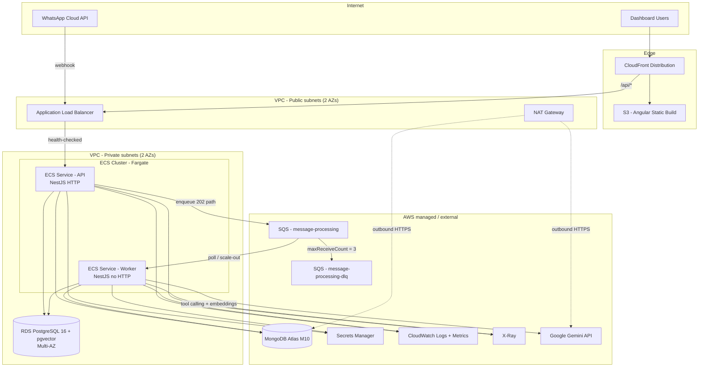

# MessengerHub — AWS Production Architecture

> **Target scenario:** 50 clinics · 20,000 messages/day · Colombia (UTC-5)  
> **Scope:** Design only — how this system runs in production on AWS. No deployment or IaC is part of this document.  
> **Related:** [DESIGN.md](../DESIGN.md) §8 · [DECISIONS.md](../DECISIONS.md) §7, §11, §12 · [AGENTS.md](../AGENTS.md)

---

## 1. Scope & Assumptions

| Item | Value |
|------|--------|
| Clinics (tenants) | 50 |
| Message volume | 20,000 inbound messages/day |
| Average rate | ~0.23 msgs/sec |
| Peak rate (est.) | ~2–4 msgs/sec (business hours in Colombia) |
| Region | `us-east-1` (default) · `sa-east-1` if data residency is required |
| LLM provider | Google Gemini via OpenAI-compatible endpoint (external SaaS) |
| Workloads | API (webhook + dashboard) and Worker (LLM pipeline) as **separate ECS services** |
| Environment | Production (dev remains Docker Compose + BullMQ locally) |

**Not in scope:** Kubernetes, multi-region active-active, event sourcing, custom WhatsApp UI. The system uses a shared multi-tenant model (see §8).

---

## 2. Architecture Diagram (Mermaid)



**Flow summary:**

1. WhatsApp hits `POST /webhooks/messages` on the ALB → Fargate **API**.
2. API validates (Zod), deduplicates by `message_id`, inserts the inbound message in MongoDB, enqueues a job, returns **202** immediately.
3. **Worker** consumes from SQS, loads conversation history, runs the LLM tool-calling loop (RAG + availability + booking), persists assistant message + AI trace, updates conversation status.
4. Dashboard (Angular) is served from S3 + CloudFront and calls the same API under `/api/*`.

---

## 3. Services & Rationale

| Concern | Service | Why this choice |
|---------|---------|-----------------|
| **Compute (API)** | ECS Fargate (API service) | Stateless NestJS HTTP process. No EC2 management. Scales behind ALB. Long-running process avoids Lambda cold starts and supports connection pooling to Postgres/Mongo. |
| **Compute (Worker)** | ECS Fargate (Worker service, same cluster) | Separate process (`worker-main.ts`, no HTTP port). Consumes SQS; scales independently on queue depth. Keeps LLM latency off the request path. |
| **Edge / API entry** | Application Load Balancer (ALB) | Frontend production config uses same-origin `apiUrl: '/api'`. ALB provides native ECS health checks, path routing (`/api/*`), TLS termination, and access logs. Simpler than API Gateway for a private NestJS service in a VPC. |
| **Frontend hosting** | Amazon S3 + CloudFront | Angular static build. CloudFront caches assets; `/api/*` forwards to ALB. Matches `environment.prod.ts`. |
| **Relational DB** | Amazon RDS PostgreSQL 16 (Multi-AZ) + **pgvector** | Source of truth for clinics, doctors, slots, appointments, knowledge base. ACID + `UNIQUE(slot_id)` prevents double-booking. pgvector keeps RAG in the same DB (no extra vector service at this scale). |
| **Document DB** | MongoDB Atlas M10 (VPC peering / private endpoint) | Conversations, messages, AI traces. Flexible schema for tool-call traces; write-heavy chat history. Atlas preferred over DocumentDB for full MongoDB compatibility. |
| **Queue** | Amazon SQS (standard) + **DLQ** | Decouples webhook (fast 202) from LLM processing (5–30s). Built-in retries via visibility timeout + DLQ (`maxReceiveCount ≈ 3`). Production binding replaces BullMQ/Redis (dev-only). |
| **Object storage** | Amazon S3 | Angular dist assets; optional raw knowledge documents (PDF/MD) with lifecycle → Glacier. |
| **Secrets** | AWS Secrets Manager + ECS task IAM | LLM API key, `DATABASE_URL`, Mongo URI, webhook/dashboard credentials. Injected as environment variables at task start. Replaces dotenv `.env` files in production. |
| **Networking** | VPC (2 AZs), public/private subnets, ALB, NAT Gateway, security groups | See §4. |
| **Observability** | CloudWatch Logs, CloudWatch Metrics, AWS X-Ray | Winston already emits structured JSON in production. Ship logs to CloudWatch. Metrics for queue depth, API latency, error rate, worker throughput. X-Ray for API → SQS → Worker traces. |
| **LLM (external)** | Google Gemini (OpenAI-compatible) | Behind domain `LLMService` interface. Not an AWS service; reached via NAT from private subnets. |

### Why ALB instead of API Gateway

| Criterion | ALB (chosen) | API Gateway HTTP API |
|-----------|--------------|----------------------|
| Same-origin `/api` with CloudFront/S3 | Natural path routing to NestJS | Possible with integrations, more moving parts |
| ECS health checks | Native target groups | Manual / Lambda health |
| VPC private services | Direct | VPC link (extra cost/complexity) |
| Managed rate limiting / JWT authorizers | WAF / app-level | Built-in (advantage for API GW) |
| Cost at low traffic | ~$25/mo ALB | ~$1/mo + data — cheaper, but less operational fit for this NestJS + VPC setup |

**Decision:** ALB for production entry. API Gateway remains a valid alternative if the team wants managed auth authorizers later without app-level JWT middleware.

---

## 4. Networking Design

### VPC layout (2 Availability Zones)

| Tier | CIDR (example) | Contents |
|------|----------------|----------|
| Public subnet A/B | `10.0.0.0/24`, `10.0.1.0/24` | ALB, NAT Gateway |
| Private subnet A/B | `10.0.10.0/24`, `10.0.11.0/24` | ECS tasks (API + Worker), RDS |

### Security groups (inbound)

| SG | From | To | Ports | Purpose |
|----|------|-----|-------|---------|
| `sg-alb` | 0.0.0.0/0 (or WhatsApp + corporate IPs) | ALB | 443 | HTTPS from internet |
| `sg-api` | `sg-alb` | API tasks | 3000 | Only ALB reaches API |
| `sg-worker` | — | — | — | No inbound; egress only |
| `sg-rds` | `sg-api`, `sg-worker` | Postgres | 5432 | DB only from app tiers |

### Egress

- **Worker → Gemini:** outbound HTTPS via **NAT Gateway** (private subnets have no public IPs).
- **Worker/API → Atlas:** VPC peering or AWS PrivateLink (preferred) to avoid public internet for Mongo.
- **API/Worker → Secrets Manager / CloudWatch / X-Ray:** VPC endpoints (optional cost win) or NAT.

### High availability

- ALB in both AZs; target groups health-check `/health` (to be exposed by API; already required for ECS).
- RDS **Multi-AZ** (standby + automatic failover < ~60s).
- ECS services spread across AZs (default Fargate behavior with multiple subnets).
- NAT: start with **one NAT** (cost); add a second per AZ if egress availability is critical.

---

## 5. Data Flow (request path)

```text
WhatsApp
  → CloudFront/ALB (TLS)
  → ECS API  POST /webhooks/messages
      → Zod validate
      → dedupe by message_id (Mongo unique sparse index)
      → find/create conversation (clinicId + patientPhone)
      → insert inbound message (Mongo)
      → SQS.SendMessage (QueueJob: conversationId, messageId, from, text, clinicId)
      → 202 Accepted (or 200 duplicate)

SQS → ECS Worker
  → load conversation history (Mongo)
  → AIOrchestrator: prompt + tools (max 5 iterations)
      → buscar_conocimiento → RDS pgvector (clinic-scoped)
      → consultar_disponibilidad / agendar_cita → RDS (clinic-scoped, UNIQUE slot)
      → Gemini chat/embeddings (via NAT)
  → persist outbound message + AITrace (Mongo)
  → update conversation status (Mongo)
  → on repeated failure → DLQ
```

**Consistency rule:** PostgreSQL commits first for appointments (source of truth). MongoDB conversation state is eventually consistent; reconciliation retries on failure (see DESIGN.md dual-DB section).

---

## 6. Scaling Strategy

Workload: **20k msgs/day**, avg ~0.23/s, peak ~2–4/s. Each message may involve 1–5 LLM tool iterations.

| Component | Baseline | Scale trigger | Upper bound (this scenario) |
|-----------|----------|---------------|------------------------------|
| **API (Fargate)** | 2 tasks × 0.5 vCPU / 1 GB | ALB target CPU > 60% or request count | 4 tasks |
| **Worker (Fargate)** | 2 tasks × 0.5 vCPU / 1 GB | SQS `ApproximateNumberOfMessagesVisible` + age | 6 tasks |
| **ALB** | 1 ALB | — | LCU-based; fine at this volume |
| **RDS** | db.t3.medium Multi-AZ (2 vCPU / 4 GB) | CPU > 70%, connections, storage | db.m5.large or read replica if dashboards grow |
| **Mongo Atlas** | M10 | Storage / connections / ops metrics | M20 if conversation volume grows |
| **SQS** | Standard queue | — | Effectively unlimited; no capacity planning |
| **NAT** | 1 NAT | — | 2 if egress HA required |

**Worker math:** If average processing is ~10–20s per message and peak is 4 msg/s, theoretical concurrency is ~40–80 in-flight jobs — but most bursts are absorbed by SQS buffering. 6 workers × modest concurrency + queue backpressure is enough; auto-scaling on queue depth handles spikes without pre-provisioning.

**What does *not* need scaling:** pgvector at ~5k knowledge docs (50 clinics × ~100 docs) — IVFFlat cosine search is fine; switch to HNSW if the corpus grows past ~100k chunks.

---

## 7. Failure Scenarios

| Component | Failure | Impact | Recovery |
|-----------|---------|--------|----------|
| **ECS API task** | Crash / OOM / deploy | Health check fails | ECS restarts/replaces task; ALB drains traffic to healthy targets |
| **ECS Worker task** | Crash mid-job | In-flight job lost | SQS visibility timeout returns message; retry up to 3; then **DLQ** for inspection |
| **RDS** | AZ outage / failover | Writes briefly unavailable | Multi-AZ automatic failover (< 60s); Prisma/Mongo drivers reconnect |
| **MongoDB Atlas** | Connection drop / failover | Conversation reads/writes fail | Driver retry + pool reconnect; worker job fails → SQS retry → DLQ if persistent |
| **SQS** | Worker fleet down | Messages accumulate | No data loss (14-day retention default); workers resume when scaled up; oldest messages monitored via CloudWatch alarm |
| **DLQ** | Messages land in DLQ | Processing stopped for those msgs | Manual replay after root-cause; alarm on DLQ depth > 0 |
| **Gemini API** | Timeout / 429 / 5xx | Turn cannot complete | Retry once with backoff; else `escalar_a_humano` / graceful patient message; never surface raw LLM errors |
| **ALB** | Regional failure | All API ingress down | Deploy ALB in 2 AZs; full region loss needs multi-region (out of scope) |
| **NAT Gateway** | Failure | Worker cannot reach Gemini/Atlas public endpoints | Use VPC endpoints for AWS APIs; Atlas via peering/PrivateLink; Gemini needs NAT — monitor NAT healthy-host metrics |
| **Secrets Manager** | Permission / missing secret | Tasks fail at startup | Task fails health checks; no silent fallback to empty secrets |
| **CloudWatch** | Logging pipeline issue | Blind spots | Keep local buffer; never block request path on log shipping |

---

## 8. Multi-Tenancy

### Model: shared database, tenant-scoped access

Each clinic is a tenant identified by `clinicId` (UUID, FK to `clinics.id`).

| Layer | Mechanism |
|-------|-----------|
| **PostgreSQL** | Every domain table has `clinic_id`. **Row-Level Security (RLS)** policies bind queries to the authenticated tenant. App repositories also filter by `clinicId` (defense in depth). |
| **MongoDB** | `clinicId` on `conversations`, `messages`, `ai_traces`. Compound indexes lead with `clinicId`. All queries include the tenant filter. |
| **RAG** | `knowledge_documents.clinic_id` + semantic search always `WHERE clinic_id = $clinicId`. Embeddings are never shared across clinics. |
| **API auth (target)** | JWT with `clinicId` claim (dashboard users / clinic admins). Webhook callers authenticate with **per-clinic API keys** (or signed WhatsApp verify tokens), not a free-for-all `clinic_id` body field. |
| **Queue jobs** | `QueueJob.clinicId` is set by the API from authenticated context, not trusted from the patient payload alone. |
| **Frontend** | Clinic context comes from the authenticated session; dashboard cannot call another tenant’s conversation by ID (ownership checks on detail endpoints). |

### Isolation guarantees

1. **Logical isolation** — tenant column on every row/document + indexes optimized per tenant.
2. **Database enforcement** — Postgres RLS so a missing `WHERE clinic_id` still cannot leak rows.
3. **Application enforcement** — every handler/query resolves `clinicId` from auth context (JWT / API key), not from arbitrary client input on by-id endpoints.
4. **No cross-tenant joins** — availability, appointments, and RAG never merge data from two clinics.

### When to revisit

| Threshold | Consider |
|-----------|----------|
| > 500 clinics | Schema-per-tenant or DB-per-tenant |
| Single clinic > 10k msgs/day | Dedicated worker queue or dedicated Atlas tier |
| Regulatory data sovereignty | Region-per-tenant or separate accounts |
| Extreme noisy-neighbor on pgvector | Per-tenant embedding namespaces or separate RDS |

### Current implementation status (honest gap map)

| Design element | In code today? |
|----------------|----------------|
| `clinic_id` / `clinicId` on all tables & collections | Yes |
| Tenant-filtered repositories & RAG SQL | Yes (application-level) |
| Postgres RLS policies | **No — target only** |
| JWT auth + `clinicId` claim | **No — target only** |
| Per-clinic webhook API keys | **No** (body `clinic_id` or `DEFAULT_CLINIC_ID`) |
| Tenant ownership check on by-id endpoints (conversations, knowledge) | **Partial / missing — IDOR risk until auth lands** |

> Production launch **requires** the auth + RLS items above. This document designs them; they are not yet implemented in the application.

---

## 9. Monthly Cost Estimate (Infrastructure)

Ballpark for **us-east-1**, on-demand, 2026 pricing order-of-magnitude. Currency: USD/month.

| Service | Configuration | Est. USD/mo |
|---------|---------------|-------------|
| ECS Fargate — API | 2 tasks × 0.5 vCPU / 1 GB | ~$18 |
| ECS Fargate — Worker | 2 tasks × 0.5 vCPU / 1 GB | ~$18 |
| Application Load Balancer | 1 ALB + LCU | ~$25 |
| NAT Gateway | 1 NAT + data processing (~100–200 GB egress) | ~$45 |
| RDS PostgreSQL | db.t3.medium Multi-AZ, 100 GB gp3 | ~$110 |
| MongoDB Atlas | M10 shared | ~$70 |
| S3 + CloudFront | Static frontend + docs | ~$8 |
| Secrets Manager | ~4 secrets | ~$4 |
| CloudWatch + X-Ray | Logs, metrics, traces | ~$20 |
| SQS | 20k msgs/day | ~$1 |
| **Infrastructure total** | | **~$320/mo** (range **$280–$380**) |

### LLM cost (separate line item)

| Item | Estimate |
|------|----------|
| Gemini Flash-class @ 20k msgs/day with tool turns | **~$180–$400/mo** |
| Embeddings for knowledge CRUD | Low (admin writes only) |

**Total run-rate:** roughly **$500–$700/month** (infra + LLM), depending on Atlas tier, token usage per turn, and NAT egress.

### Cost levers

- Reserved/ savings plans on Fargate if usage is steady.
- Single NAT (not per-AZ) until HA egress is mandatory.
- CloudFront caching for static assets; compress logs (CloudWatch log classes).
- If Atlas is too costly: DocumentDB or self-managed Mongo on ECS (trade-off: ops burden) — only if budget forces it.
- Older DESIGN.md estimate (~$170 infra) omitted ALB + NAT and undersized RDS/Atlas; use this document’s numbers for planning.

---

## 10. Alternatives Discarded

| Option | Why not chosen |
|--------|----------------|
| **Lambda for API/Worker** | Cold starts; 15-min limit; weaker fit for long-lived DB pools and multi-iteration LLM calls. |
| **Aurora PostgreSQL** | Overkill at 50 clinics; higher baseline cost; RDS + pgvector is enough. |
| **Amazon DocumentDB** | MongoDB-compatible but not 100% parity (aggregation/change streams). Atlas preferred unless AWS-native is mandatory. |
| **Kinesis** | Streaming fan-out is not needed; point-to-point + DLQ fits SQS better. |
| **BullMQ + ElastiCache in prod** | Possible, but SQS is managed, cheaper, and already the documented production target (DECISIONS §7). BullMQ stays for local/dev. |
| **API Gateway as sole entry** | Valid alternative; ALB chosen for same-origin `/api`, ECS health checks, and simpler VPC integration. |
| **EKS / Kubernetes** | Unnecessary operational complexity for two Fargate services (AGENTS.md: avoid overengineering). |
| **DB-per-tenant** | Right for hundreds of clinics or hard isolation; wrong cost/ops trade-off for 50 tenants today. |
| **Dedicated vector DB (Pinecone/Qdrant)** | Extra service + cost; pgvector is sufficient at this corpus size (DECISIONS §5). |

---

## 11. Gap Map: Design vs Current Code

This architecture is the **production target**. Local development uses Docker Compose (Postgres, Mongo, Redis/BullMQ). The following are designed but **not implemented** in the application codebase yet:

| Area | Design | Code today |
|------|--------|------------|
| Queue | SQS + DLQ + redrive | BullMQ + Redis (`BullMQQueueService`) |
| Secrets | Secrets Manager | `.env` / dotenv |
| Compute | ECS Fargate (API + Worker) | `pnpm dev` processes on localhost |
| Postgres RLS | Tenant policies | Application-level `clinic_id` filters only |
| AuthN/AuthZ | JWT `clinicId` + webhook API keys | No auth layer |
| Observability shipping | CloudWatch + X-Ray | Winston JSON (prod) to local files |
| Frontend hosting | S3 + CloudFront | `ng serve` / local build |
| IaC | **Terraform in `infra/terraform/`** (us-east-1 + sa-east-1 pilot-light) | Implemented in repo — not yet applied |
| Docker images | ECR + `apps/api/Dockerfile` (API + worker CMDs) | Dockerfile present; push via ECR before ECS deploy |
| ALB health endpoint | `/health` on API | Exists in Nest (`app.controller.ts`) |

**Adapter path:** domain already depends on `QueueService` / `LLMService` / repository interfaces. A `SqsQueueService` infrastructure adapter can replace BullMQ without touching handlers (align DLQ semantics on the domain interface).

---

## 12. References

| Document | Relevance |
|----------|-----------|
| [DESIGN.md](../DESIGN.md) §8 | Baseline AWS diagram, services, early cost estimate |
| [DESIGN.md](../DESIGN.md) §1 | Data model, pgvector, dual-DB consistency |
| [DECISIONS.md](../DECISIONS.md) §7 | Queue + worker (SQS prod / BullMQ dev) |
| [DECISIONS.md](../DECISIONS.md) §11 | AWS architecture decision record |
| [DECISIONS.md](../DECISIONS.md) §12 | Multi-tenancy decision record |
| [AGENTS.md](../AGENTS.md) | Clean Architecture, logging, plan workflow |
| `apps/api/.env.example` | Config surface mapped to Secrets Manager |
| `apps/web/src/environments/environment.prod.ts` | Same-origin `/api` → CloudFront + ALB |

---

*Document created: 2026-10-04 · Plan: `plans/` · No deployment implied.*
